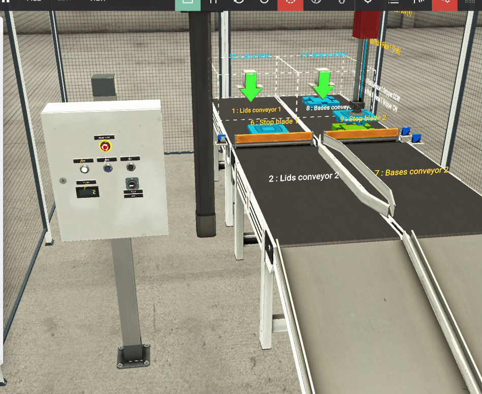

# Two-Axis Pick & Place (Assembler Analog) - SCL on TIA Portal

A PLC-controlled assembly cell simulated in Factory IO. A two-axis arm picks a lid from one conveyor, places it on a base waiting on a second conveyor, and ejects the finished part automatically. The control logic is written in **SCL (Structured Control Language)** as a step-sequence state machine, with a custom **SIMATIC HMI** for operation and monitoring.

> 🎥 **Demo video:** [your LinkedIn](https://www.linkedin.com/feed/update/urn:li:activity:7508129953331449856/) / [YouTube link here_](https://www.youtube.com/watch?v=NcT9poYpcM0)



## Tech stack

| Area | Tool |
|---|---|
| PLC programming | Siemens TIA Portal, SCL |
| PLC | S7-1200 (CPU 1211C DC/DC/DC), simulated with S7-PLCSIM |
| Simulation | Factory IO - *Assembler (Analog)* scene |
| HMI | SIMATIC HMI (RT Simulator) |

## How it works

The arm sequence is a `CASE` state machine driven by a `Seq_Step` variable. Each step commands an axis setpoint and waits for position feedback before moving on.

| Step | Action | Transition condition |
|---|---|---|
| 0 | Wait for parts | Lid at place **and** base at place |
| 10 | Move X over the lid conveyor (setpoint 1.2) | X within tolerance |
| 20 | Lower Z (setpoint 10.0) | Z >= 9.0 |
| 30 | Grab | immediate |
| 40 | Raise Z (setpoint 0.0) | Z <= 0.5 |
| 50 | Move X over the base conveyor (setpoint 9.2) | X >= 8.0 |
| 60 | Lower Z onto the base (setpoint 8.1) | Z >= 8.0 |
| 70 | Release | 1 s timer (`Release_Timer`) |
| 80 | Raise Z | Z <= 0.5 |
| 90 | Open stop blade 2, run conveyors, count part | 2 s timer (`Push_Timer`) |

Operation: Auto / Start / Stop / Reset / Emergency stop from the HMI or the scene's control panel, plus a part counter and live X/Z position display.

## I/O overview

| Signal | Address | Type |
|---|---|---|
| Item detected | %I0.0 | Input |
| Lid at place / Base at place | %I0.1 / %I0.2 | Input |
| Start / Reset / Stop / Emergency stop | %I0.4 / %I0.5 / %I0.6 / %I0.7 | Input |
| Auto | %I1.0 | Input |
| X position / Z position | %ID30 / %ID34 | REAL input |
| Lids conveyor 1 / Bases conveyor 1 | %Q0.0 / %Q0.3 | Output |
| Stop blade 1 / Stop blade 2 | %Q0.1 / %Q0.4 | Output |
| Grab | %Q0.6 | Output |
| X set point / Z set point | %QD30 / %QD34 | REAL output |
| Counter | %QD38 | DINT output |

## Challenges and how I solved them

**1. Stop / Emergency stop signals were inverted.**
The system would not start even with Start pressed. Watching the tags online showed `Stop` and `Emergency stop` were `TRUE` while untouched: in this scene they are normally-closed style signals (TRUE = healthy). Fixing the logic polarity solved it.

**2. Arm moved to the wrong place / released in the wrong spot.**
Placement setpoints had to be measured, not guessed. I jogged the arm manually, read the real X/Z feedback at the pick and place positions, and tuned the placement depth so the lid lands on top of the base instead of colliding with it.

**3. Race condition between the program and the physical simulation (the main one).**
The PLC scan takes milliseconds, but conveyors and stop blades need real time to react. Two things went wrong:
- One-shot commands (open the blade, start the conveyor) lasted a single scan.
- Unconditional sections of the program overwrote those commands on the very next scan.

The fix: hold the command for a fixed time with TON timers (`Release_Timer`, `Push_Timer`) and exclude the conflicting sections while the eject step is active.

## What I learned

- Design step sequences so every output has a single owner at any moment.
- Use position feedback with tolerances, not exact values.
- Measure setpoints on the actual model; do not estimate them.
- Debug by monitoring tags online and comparing what the logic thinks with what the plant is actually doing.

## Repository structure

```
├── README.md
├── src/
│   └── PickPlace_Main.scl        # main SCL logic
├── tia-project/
│   └── Assembler_Analog.zap*     # TIA Portal archive (state the version)
├── factoryio/
│   └── Assembler_Analog.factoryio
└── docs/
    ├── demo.png
    └── hmi.png
```

## Running it

1. Open the TIA Portal archive and download to S7-PLCSIM (or your PLC).
2. In Factory IO, select the Siemens S7-PLCSIM driver and map the I/O as listed above.
3. Start the HMI runtime, set Auto, then press Start.

## Next steps

- Re-implement the Palletizer project in SCL and compare it with the Ladder version.
- Add alarms and diagnostics to the HMI.
- Move to the Elevator and Automated Warehouse scenes.

## Author

**Bencheikh Mohamed Idris** - Junior Automation Engineer | PLC & SCADA | Digital Twin
[LinkedIn](https://www.linkedin.com/in/bencheikh-mohamed-idris)
